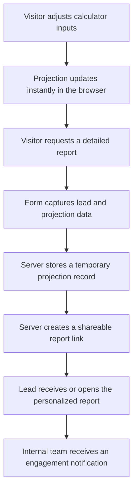

# ROI Calculator - Technical Breakdown

The SkeilApps website includes an interactive ROI calculator designed for ecommerce brands that are considering launching their own mobile app.

The goal of the calculator is not to guarantee results. It is a sales and education tool that turns an abstract offer into a concrete projection: traffic, conversion, recurring customers, app downloads and potential extra revenue.

## What the calculator does

The calculator asks for the core metrics of an ecommerce business:

- Monthly website visits.
- Average order value.
- Website conversion rate.
- Repeat purchase rate.
- Current monthly revenue.
- Monthly growth rate.
- Monthly advertising budget for app acquisition.
- Ecommerce category or sector.

Using those inputs, it estimates:

- Organic app downloads from existing customers.
- Paid app downloads from an app advertising budget.
- App conversion rate.
- App repeat purchase behavior.
- App average order value.
- Extra revenue projected for year 1 and year 2.
- A month-by-month chart comparing website-only revenue with additional app revenue.

## Frontend logic

The frontend is built as an embedded calculator widget. It uses range controls for input values, a sector selector and a chart to update the projection instantly.

Main frontend responsibilities:

- Keep all slider values in sync with the displayed numbers.
- Apply different sector assumptions depending on the ecommerce category.
- Simulate 24 months of revenue and app adoption.
- Show year 1 or year 2 projections.
- Render a stacked bar chart with the baseline revenue and the estimated app uplift.
- Store the latest projection data so it can be used when the lead requests a report.

Likely frontend stack:

- HTML and CSS for the embedded widget.
- JavaScript for the projection model.
- Chart.js for the chart visualization.
- jQuery for WordPress/form integration.

## Projection model

The projection runs a two-year simulation. At a high level, the model works like this:

```text
website_revenue_month_n = current_revenue * monthly_growth
estimated_web_customers = website_visits * website_conversion_rate
organic_app_downloads = estimated_web_customers * sector_download_rate
paid_app_downloads = app_ads_budget / estimated_cost_per_install
active_app_users = retained_download_cohorts_over_time
app_revenue = active_app_users * app_conversion_rate * app_average_order_value
extra_revenue = organic_app_revenue + paid_app_revenue + baseline_app_uplift
```

The calculator also changes assumptions by sector. For example, ecommerce categories with stronger repeat purchase behavior can have different app recurrence and conversion assumptions than categories with longer purchase cycles.

## Report flow

The calculator is connected to a personalized report flow.



The production implementation uses WordPress on the backend, but this public repository intentionally describes the flow without exposing the production PHP, private action names, email addresses, internal templates or endpoint paths.

## Backend responsibilities

The backend handles the sensitive parts of the report workflow:

- Sanitize form input before using it.
- Store the projection on the server with a short temporary identifier.
- Generate a personalized report link.
- Send a formatted report email.
- Read the stored projection when the report page loads.
- Notify the internal team when a report is opened.
- Count report openings to help prioritize follow-up.

## Why the full code is not public

The complete implementation should stay private because it includes operational details that are useful for the business but not necessary for a public portfolio.

This public repo does not include:

- Production PHP code.
- Real WordPress action names.
- Email addresses.
- Internal URLs.
- Customer or lead data.
- Private email templates.
- Security-sensitive endpoint details.
- Credentials, tokens or environment variables.

Publishing the raw production code would not add much value for a portfolio and would increase operational risk. The safer approach is to document the architecture, explain the logic and show the product thinking behind it.

## What this shows

This feature shows the ability to combine product, growth and technical implementation:

- Ecommerce business modeling.
- Interactive frontend UX.
- Data visualization.
- Lead capture.
- Personalized report generation.
- WordPress integration.
- Sales workflow automation.
- Privacy-aware public documentation.
